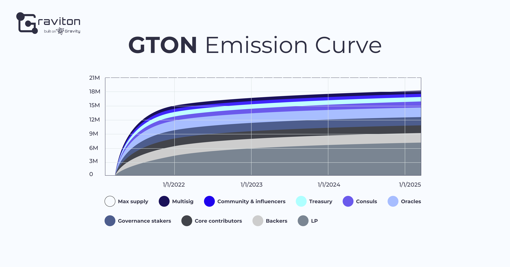
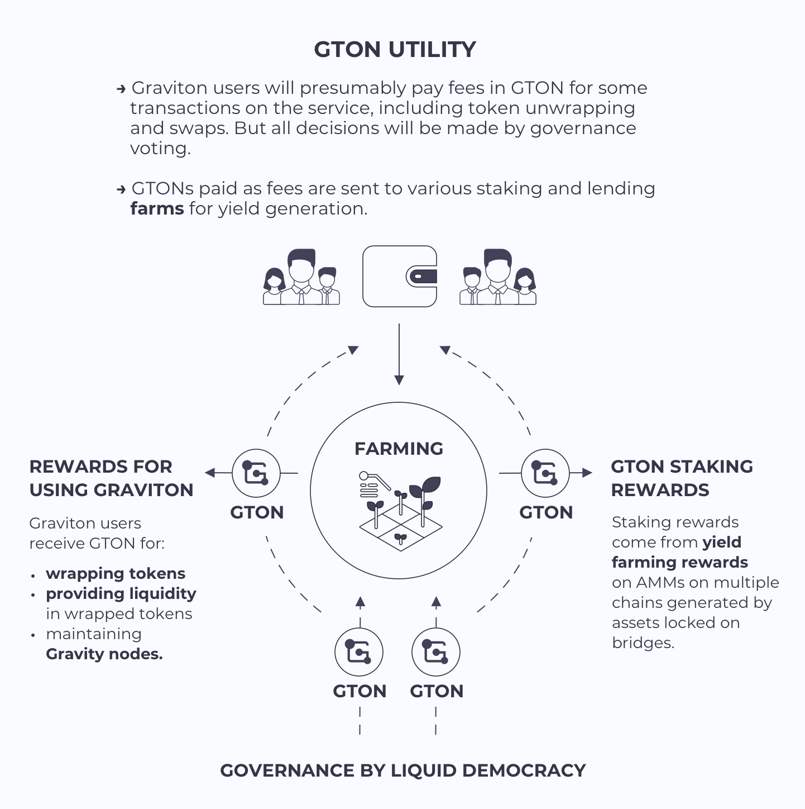

# Graviton: Overview

## Problem 

— DeFi on alternative blockchain networks lack liquidity

— DeFi on Ethereum are burdened with enormous fees

— The use of alternative networks is hampered by complicated, multi-step user experience and insufficient liquidity of tokens wrapped in other blockchains.

## Solution

**Graviton is a universal wrapped tokens’ liquidity incentivization solution, providing seamless access to multiple chains with an Ethereum mirror account and creating a reward-based synergetic economy around wrapped assets.**

**Graviton unites the communities of multiple chains/AMMs/DeFi projects and provides them with governance tools for boosting liquidity and increasing yield generation.**

**Graviton provides an infrastructure for Ethereum-account owners to let them effortlessly access a wide range of alternative chains via mirror accounts.\***

_\*Ethereum mirror accounts:_ A mirror account in a destination chain, other than Ethereum, carries out \(“mirrors”\) transactions signed by an Ethereum account owner.

## How it works

1. A mirror account is created in the target chain to run transactions signed by the corresponding Ethereum account owner.
2. Wrapped tokens are issued in the target chain by locking tokens on Ethereum as the origin chain and wrapping them via [Gravity](https://gravity.tech), Multichain.xyz, or potentially other bridge solutions.
3. AMMs enable swaps of wrapped tokens and liquidity provision.
4. A transaction fees controller charges users in ETH tokens, which are converted to native tokens of other platforms to pay for transactions with a mirror account. The fees size is equivalent to the standard transaction fees of the destination chain.
5. Governance is based on DAO model and stimulates liquidity through reward system.

**As a result, an owner of an Ethereum account can use DeFi services in any other blockchain networks - Binance Smart Chain, Tron, Avalanche, Waves, Fantom, Huobi Eco Chain, by signing transactions with MetaMask, Ledger or Trezor.**

## GTON

**GTON** is a farmable governance token with a gradually increasing circulating supply, limited to **21 000 000**. ****

GTON is minted according to the following emission formula:

$$
y = \frac{a}{(x+\frac{a}{c}+o)+c},\\
\text{where c = 21000000,}\\ 
\text{a = 11099999999999,}\\ 
\text{o is the starting block of farming,}\\
\text{x is Ethereum's current block count}
$$

GTON is used to pay Graviton fees and farming rewards, acting as the Graviton system’s key fuel.

## Milestones

## Join Graviton as an Early Bird

**Contribute to the treasury as an early bird:**

You will:

• empower [VenLab](https://venlab.dev), a team with great InDeFi experience that created the [Neutrino](https://neutrino.at) and [Gravity protocols](https://gravity.tech), 

• get an early-bird investment opportunity, which ensures your permanent governance role,

• start farming GTON and permanently enshrine your share in the treasury.

