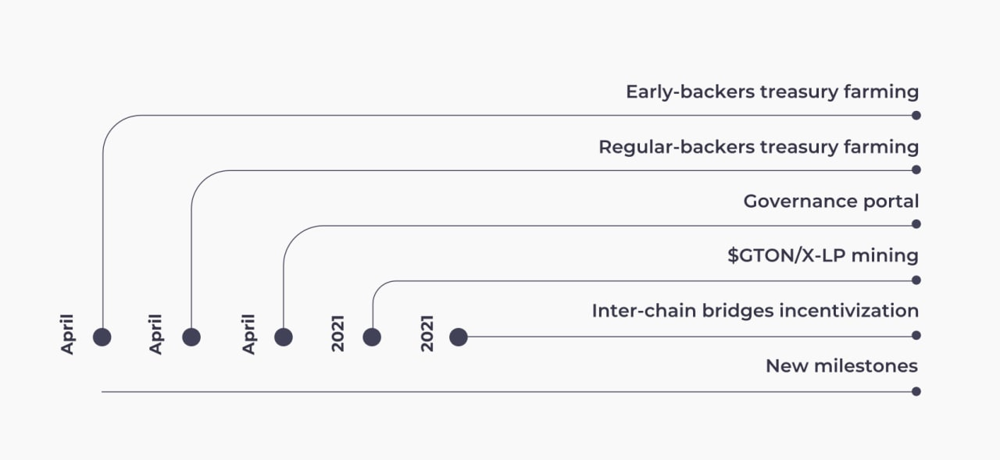

# Concepts

## Problem 

— DeFi on alternative blockchain networks lack liquidity

— DeFi on Ethereum are burdened with enormous fees

— The use of alternative networks is hampered by complicated, multi-step user experience and insufficient liquidity of tokens wrapped in other blockchains

## Solution

**Graviton is a universal wrapped tokens’ liquidity incentivization solution, providing seamless access to multiple chains with an Ethereum mirror account and creating a reward-based synergetic economy around wrapped assets.**

**Graviton unites the communities of multiple chains/AMMs/DeFi projects and provides them with tools for boosting liquidity and increasing yield generation.**

**Graviton also provides an infrastructure for Ethereum-account owners to let them effortlessly access a wide range of alternative chains via mirror accounts.\***

_\*Ethereum mirror accounts:_ A mirror account in a destination chain, other than Ethereum, carries out \(“mirrors”\) transactions signed by an Ethereum account owner.

## GTON

**GTON** is a governance and LP reward token with a max supply of **21 000 000**. ****

GTON is unlocked gradually according to the following formula:

$$
y = \frac{a}{(x+\frac{a}{c}+o)+c},\\
\text{where c = 21000000,}\\ 
\text{a = 11099999999999,}\\ 
\text{o is the starting block of farming,}\\
\text{x is Ethereum's current block count}
$$

GTON is used to pay Graviton fees and farming rewards, providing utility for the Graviton system.

## Why will GTON be in demand?

— Access to other chains:

Graviton will be utilized by the communities of the integrated networks reaching new markets. Due to its blockchain- and bridge-agnostic approach, Graviton is a universal hub for inter-chain liquidity and activity.

— Yield increase for LPs:

GTON will act as an LP farming reward for wrapped tokens 

— Initial Liquidity from EB Treasury:

Early birds’ Treasury will be used as collateral for GTON initial liquidity to set Graviton’s tokenomics in motion

— Product utility:

GTON will be used to pay fees for operations with mirror accounts, i.e. wrapping and unwrapping tokens

— Additional yield:

GTON will be stakable and generate extra yield

— Governance:

GTON will act as an influence tool for promotion of wrapped tokens and their liquidity incentivization, as well as of AMMs, and entire ecosystems  

## Milestones

## Join Graviton as an Early Bird

Participate in Early Birds by depositing an equivalent of at least $1,000 in DAI, USDT, USDC, BUSD, HUSD, UST, USDP, or USDN **-&gt;** [**Graviton Early Birds**](https://v1.graviton.one%20%20) ****

You will:

• empower [VenLab](https://venlab.dev), a team with great InDeFi experience that created the [Neutrino](https://neutrino.at) and [Gravity protocols](https://gravity.tech), 

• start receiving GTON according to the unlocking schedule and permanently enshrine your GTON share,

• automatically provide initial liquidity for GTON and set the entire tokenomics in motion

