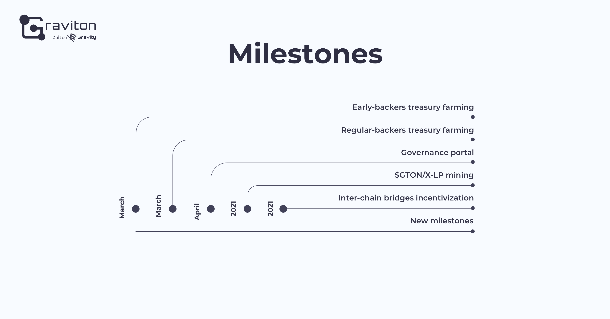

# Graviton: Overview

## Problem 

— DeFi on alternative blockchain networks lack liquidity

— DeFi on Ethereum are burdened with enormous fees

— The use of alternative networks is hampered by complicated, multi-step user experience and insufficient liquidity of tokens wrapped in other blockchains.

## Solution

**Graviton is a governance framework and liquidity incentivization solution for inter-chain swaps and wrapped tokens.**

**Graviton offers seamless inter-chain token transfers thanks to trustless bridges and Ethereum mirror accounts. Graviton also creates a reward-based economy around wrapped tokens that incentivizes liquidity.**

_\*Ethereum mirror accounts:_ A mirror account in a destination chain, other than Ethereum, carries out \(“mirrors”\) transactions signed by an Ethereum account owner.

## How it works

1. A mirror account is created in the target chain to run transactions signed by the corresponding Ethereum account owner.
2. Wrapped tokens are issued in the target chain by locking tokens on Ethereum as the origin chain and wrapping them via Gravity.
3. AMM enables swaps of wrapped tokens and liquidity providing.
4. A transaction fees controller charges users in ETH tokens, which are converted to native tokens of other platforms to pay for transactions with a mirror account. The fees size is equivalent to the standard transaction fees of the destination chain.
5. Governance is based on DAO model and stimulates liquidity through reward system.

**As a result, an owner of an Ethereum account can use DeFi services in any other blockchain networks - Binance Smart Chain, Tron, Avalanche, Waves, Fantom, Huobi Eco Chain, by signing transactions with MetaMask, Ledger or Trezor.**

## GTON

**GTON** is a farmable governance token with a gradually increasing circulating supply, limited to **21,000,000**. ****

GTON is used to pay Graviton fees and farming rewards, acting as the Graviton system’s key fuel.

## Milestones

## Join Graviton as an Early Bird

**Contribute to the treasury as an early bird:**

You will:

• empower VenLab, a team with great InDeFi experience that created the Neutrino and Gravity protocols, 

• get an early-bird investment opportunity, which ensures your permanent governance role,

• start farming GTON and permanently enshrine your share in the treasury.

