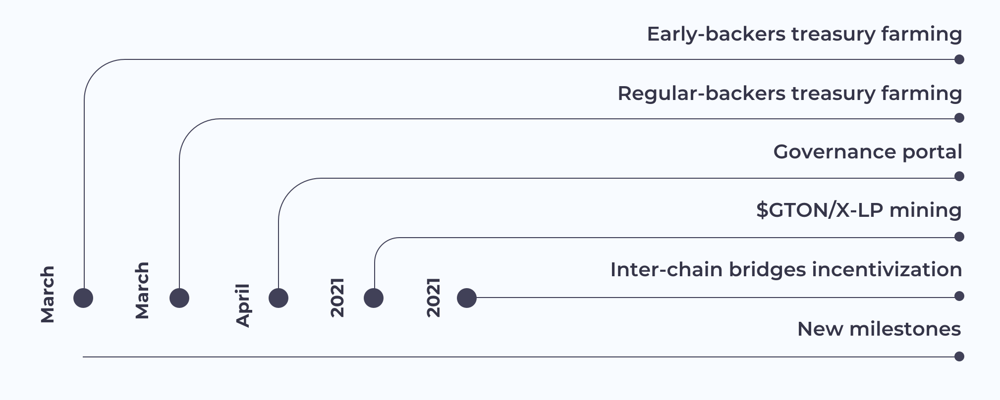

# FAQ

## What is Graviton?

Graviton is a governance framework and liquidity incentivization solution for inter-chain swaps and wrapped tokens.

Graviton offers seamless inter-chain token transfers thanks to trustless bridges and Ethereum mirror accounts. Graviton also creates a reward-based economy around wrapped tokens that incentivizes liquidity.

Graviton operates on the decentralized treasury governance model \(DGF\), which combines an AMM service enabling instant token swaps and liquidity providing opportunities with DAO governance.

## How does it work?

Leveraging Gravity, a token- and blockchain-agnostic oracles network for cross-chain communication, Graviton enables Ethereum accounts to interact trustlessly with any blockchain, maintaining a sufficient decentralization level. This facilitates safe and fast inter-chain asset swapping via bridges. 

But Graviton not only allows for creation and swapping of issued wrapped tokens, but also incentivizes users to lock tokens in gateways and maintain their liquidity in decentralized AMM pools with its governance token GTON. GTON rewards come from the following sources:

* GTON tokens are issued when a user invests in the treasury
* From accumulated fees
* Assets locked in bridges are sent to farming in various DeFi services, farmed tokens are swapped for GTON and subsequently distributed among Graviton farmers.

In general, the process consists of five simple steps: 

1. A **mirror account** is created in the target chain to run transactions signed by the corresponding Ethereum account’s owner. A mirror account in a destination chain, other than Ethereum, carries out transactions signed by the Ethereum account owner - “mirror transactions.” 

2. **Wrapped tokens** are issued in the target chain by locking tokens on Ethereum as the origin chain and wrapping them via Gravity.

3. The **AMM** enables swaps of wrapped tokens and provides them to liquidity pools in farms on multiple chains.

4. A **transaction fees controller** charges users in ETH tokens, which are converted into native tokens of other platforms to pay for transactions with a mirror account. The fees size is equivalent to the standard transaction fee of the destination chain.

5. **Reward-based governance** stimulates users to swap tokens and supply liquidity.

As a result, the Ethereum account owner can use DeFi services in any other blockchain networks - Binance Smart Chain, Tron, Avalanche, Waves, Fantom, Huobi Eco Chain by signing transactions with MetaMask, Ledger or Trezor.

## What technology for inter-chain swaps is used in Graviton?

One of our key open-source solutions, which lies under the hood of Graviton and enables a sufficient level of decentralization, is Gravity -- a system of oracles for cross-chain communication.

The Gravity network is blockchain- and token-agnostic, and it leverages a decentralized p2p reputation mechanism based on the so-called EigenTrust algorithm. As a foundational cross-chain communication element, cross-chain asset swapping  via gateways is implemented on top of Gravity as the so-called SuSy \(SuperSymmetry\) protocol.

Utilizing Gravity as an underlying technology, mirror accounts are implemented to reduce blockchain fees and streamline user experience. The mechanism of mirror accounts comes into action when a user with an account in the origin chain \(Ethereum, for instance\) attempts to interact with a blockchain that is non-native to the wallet used. The mirror account is created automatically and matches transactions signed by an Ethereum account owner in a destination chain. 

## How does the Graviton governance work?

Graviton is governed by decentralized governance farming \(DGF\), a novel DAO concept for self-financing, decentralized development and governance token issuance.  

This approach includes several features:

### Collecting funds in stablecoins to a treasury 

A contribution to the treasury ensures a user a governance role and power, allowing them to participate in governance farming. For supplying liquidity at the early-bird stage, a user is granted an early-backer role. This advantage is not available when supplying at later stages.

Early backers receive a fixed share of the total governance rewards for the future periods. In contrast, regular backers’ share gets diluted as new participants contribute to the treasury. It is important to note that only the future size of the farming reward decreases for contributors, while everyone still joins the treasury on equal terms. 

### Governance roles determination

The Graviton launch scheme stipulates several roles, which are described in the table below:

| role | description | role timeline | % from mined GTON supply |
| :--- | :--- | :--- | :--- |
| treasury | treasury smart contract account | permanent | 4.50% |
| leader | Aleksei or another elected project leader | impermanent | 5.00% |
| lead contributor | superior lvl experienced dev/designer/product | impermanent | 5.00% |
| contributor | middle lvl experienced dev/designer/product | impermanent | 2.00% |
| oracle | Gravity node / backend / cloud provider | impermanent | 11.00% |
| consul | active governance decision maker | impermanent | 5.50% |
| multisig | signature provider for smart contract migrations | impermanent | 1.00% |
| backers | treasury investors | permanent | 7.00% |
| early backers | "early bird" treasury investors | permanent | 7.00% |
| community | community/ advocates / ambassadors / local community | impermanent | 2.00% |
| influencers | public speakers / SMM influencers | impermanent | 2.00% |
| governance stakers | governance staking / delegation to consuls | user | 6.00% |
| LP-GTON | AMM, DEX liquidity providers of governance tokens | user | 18.00% |
| LP-WT | AMM, DEX liquidity providers of wrapped tokens | user | 24.00% |

Each role is supposed to perform specific functions and has its share enshrined as a percentage of the total governance farming rewards. However, the share can be changed by governance voting. Some of the roles, like consuls, influencers, community advocates are appointed by voting of all token holders.

One of the roles - that of a consul - implies a wider range of responsibilities. Consuls can be delegated GTON by token holders that are able to transfer their governance power. Only consuls are allowed to initiate new proposals, and their main task is to vote with the majority of the delegated stake. At the same time, large token holders can be nominated for the role of consuls.

### Governance by liquid democracy

Most settings in Graviton’s management and budgeting of collected funds can be decided by governance voting. Such decisions can include:

* farming ratios \(share of farmed GTON per governance role\),
* farming constants and formulas,
* fee accrual and distribution mechanics,
* GTON emission curve,
* election of consuls, etc.

This approach leaves decision-making and project financing to token holders.

## What wallet should I connect to use Graviton?

Graviton takes advantage of Ethereum accounts to operate with assets. Connect to your MetaMask for signing transactions. In the subsequent releases, the option of using Ledger, Trezor or other wallets will be added.

## What is GTON?

GTON is a farmable governance token with a gradually increasing circulating supply, limited to 21,000,000. GTON is used to pay Graviton fees and as farming rewards, acting as the Graviton system’s key fuel. 

## How do I get GTON?

Initially, GTON can be farmed on the Graviton portal by supplying stablecoins to the treasury. Later on, GTON will be paid as a reward for issuing wrapped tokens, providing liquidity on whitelisted AMM services and by staking already farmed GTON. 

## When can I start farming GTON?

GTON farming will be initially available to early backers. Subsequently, public governance farming will be launched and an opportunity to supply stablecoins to the treasury will become available for regular backers. Other farming options will be launched in late Q2.

## How can I see my farmed GTON?

Go to the Portfolio section. Make sure that you’re connected to your MetaMask wallet. In this section, you can see:

* your funds invested in the treasury \(early-backer share or baсker share\) as percentage of the total treasury fund and in $,
* your farmed GTON for treasury supply \(governance farming\).

In subsequent releases, the following information will be added:

* your farmed GTON split by origin: either received as a governance reward, coming from wrapping tokens or earned for liquidity provision,
* your harvested \(or claimed\) GTONs.

## How can I claim my GTON?

You can claim your GTONs by clicking the “Harvest” button in the Portfolio section. This option will be available in the subsequent releases of Graviton.

## Why provide liquidity for wrapped tokens?

Providing liquidity for wrapped tokens with Graviton enables users to farm GTON tokens. Simply wrapping tokens is not sufficient to make them useful in a destination chain–liquidity provision is also required for trading activities to begin. Therefore, Graviton also incentivizes users to supply liquidity to wrapped tokens on blockchains integrated with Gravity.

This reward option will be available in Graviton’s subsequent releases.

