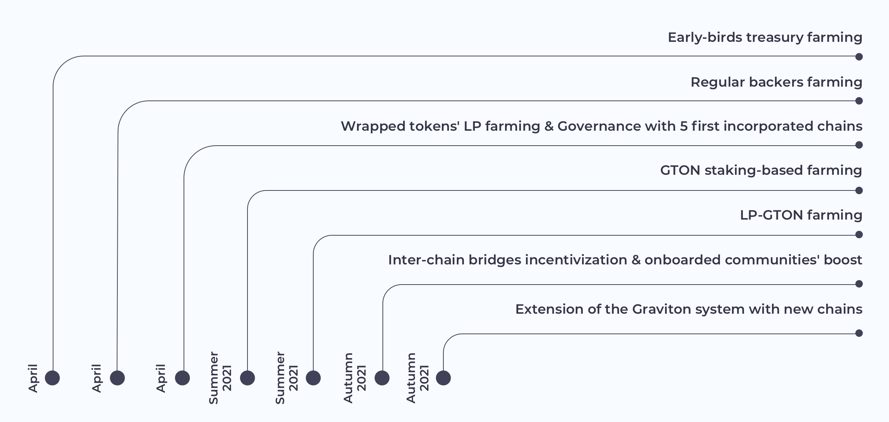

# FAQ

## What is Graviton?

Graviton is a universal wrapped tokens’ liquidity incentivization solution, providing seamless access to multiple chains with an Ethereum mirror account and creating a reward-based synergetic economy around wrapped assets.

Graviton unites the communities of multiple chains/AMMs/DeFi projects and provides them with governance tools for boosting liquidity and increasing yield generation.

Graviton provides an infrastructure for Ethereum-account owners to let them effortlessly access a wide range of alternative chains via mirror accounts.\*

## How does it work?

Graviton incentivizes users to lock tokens in gateways and maintain their liquidity in decentralized AMM pools with its governance token GTON. GTON rewards come from the following sources:

* GTON tokens are issued when a user invests in the treasury
* From accumulated fees
* Assets locked in bridges are sent to farming in various DeFi services, farmed tokens are swapped for GTON and subsequently distributed among Graviton farmers.

Graviton consists of five components: 

1. A **mirror account** is created in the target chain to run transactions signed by the corresponding Ethereum account’s owner. A mirror account in a destination chain, other than Ethereum, carries out transactions signed by the Ethereum account owner - “mirror transactions.” 

2. **Wrapped tokens** are issued in the target chain by locking tokens on Ethereum as the origin chain and wrapping them via [SuSy](https://susy.one/swap).

3. The **AMM** enables swaps of wrapped tokens and provides them to liquidity pools in farms on multiple chains.

4. A **transaction fees controller** charges users in ETH tokens, which are converted into native tokens of other platforms to pay for transactions with a mirror account. The fees size is equivalent to the standard transaction fee of the destination chain.

5. **Reward-based governance** stimulates users to swap tokens and supply liquidity.

As a result, the Ethereum account owner can use DeFi services in any other blockchain networks - Binance Smart Chain, Tron, Avalanche, Waves, Fantom, Huobi Eco Chain by signing transactions with MetaMask, Ledger or Trezor.

## How does the Graviton governance work?

Graviton governance is based on several concepts:

### Collecting funds in stablecoins to a treasury

A contribution to the treasury ensures a user a governance role and power, allowing them to unlock a share of GTONs. For supplying liquidity at the early-bird stage, a user is granted an early-bird role. Early birds receive a fixed share of the total governance rewards for the future periods. It is important to note that only the future size of the farming reward decreases for contributors, while everyone still joins the treasury on equal terms. This advantage is not available when supplying at later stages.

### SPI \(Strategic Partners & Investors\) Allocation

We are also designating a separate allocation for strategic partners to achieve flexibility in project funding, in provision of liquidity, as well as an increased utility and investment attractiveness of the GTON token. Now, alongside a 10% allocation to early birds, 20% of the allocation is assigned to strategic deals with potential partners \(partners, integrations, listings and investors\). This separation prevents large deposits from our strategic partners from diluting the shares of EB participants, which will result in a fairer community-driven launch.

### Governance roles determination

The Graviton launch scheme stipulates several roles, which are described in the table below:

| Category | Roles | Share by category |
| :--- | :--- | :--- |
| Backers | backers | 3,00% |
|  | early birds | 10,00% |
| LP | LP-GTON, LP-WT, governance stakers | 33,00% |
| Strategic partners | partners and investors | 20,00% |
| Operations | treasury, oracle, community, influencers | 14,00% |
| Core Contributors | consuls, core development team, multisig | 20,00% |

Each role is supposed to perform specific functions and has its share enshrined as a percentage of the total governance farming rewards. However, the share can be changed by governance voting. Some of the roles, like consuls, influencers, community advocates are appointed by voting of all token holders.

One of the roles - that of a consul - implies a wider range of responsibilities. Consuls can be delegated GTON by token holders that are able to transfer their governance power. Only consuls are allowed to initiate new proposals, and their main task is to vote with the majority of the delegated stake. At the same time, large token holders can be nominated for the role of consuls.

### Governance by liquid democracy

Most settings in Graviton’s management and budgeting of collected funds can be decided by governance voting. Such decisions can include:

* farming constants and formulas,
* fee accrual and distribution mechanics,
* election of consuls, etc.

## What is GTON?

GTON is a governance and LP reward token with a max supply of 21 000 000. ****

## How do I get GTON?

Initially, a share in GTON can be secured on the Graviton portal by supplying stablecoins to the treasury. Later on, GTON will be paid as a reward for issuing wrapped tokens, providing liquidity on whitelisted AMM services and by staking already farmed GTON. 

## When can I start farming GTON?

GTON farming will be initially available to early backers. Subsequently, public governance farming will be launched and an opportunity to supply stablecoins to the treasury will become available for regular backers. Other farming options will be launched in late Q2.

## How can I see my farmed GTON?

Go to the Portfolio section. Make sure that you’re connected to your MetaMask wallet. In this section, you can see:

* your funds invested in the treasury \(early-bird share or baсker share\) as percentage of the total treasury fund and in $,
* your farmed GTON for treasury supply.

In subsequent releases, the following information will be added:

* your farmed GTON split by origin: either received as a governance reward, coming from wrapping tokens or earned for liquidity provision,
* your harvested \(or claimed\) GTONs.

## How can I claim my GTON?

You can claim your GTONs by clicking the “Harvest” button in the Portfolio section. This option will be available in the subsequent releases of Graviton.

