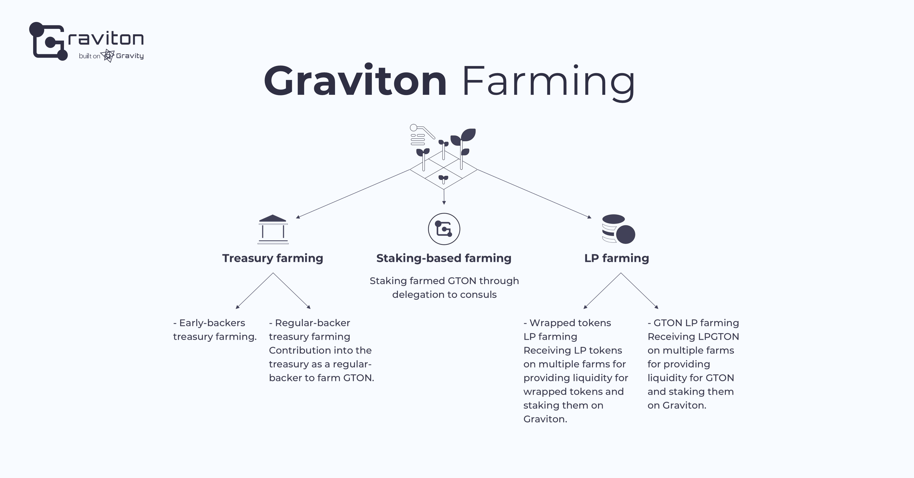

# Farming Options

Graviton's yield farming system consists of three components: 

* governance farming of the GTON token, 
* staking of farmed GTONs, and 
* the inter-chain DeFi reward. 

This combination of the Graviton system, and the parameters thereof, can be configured by community governance. 

## Treasury farming 

### Early-backers treasury farming 

Early-backers treasury farming will be available for a limited period after the launch of Graviton. The minimum investment is the equivalent of $1,000 in DAI, USDT, USDC, BUSD, HUSD, TUDS, UST, sUSD, mUSD, USDK, USDP, GUSD or USDN. Users that make investments during this period become early-bird investors or early backers and are entitled to 7% share of the entire farming income in GTON, which is a fixed percentage independent of the number of new contributions. The 7% share will be divided between all early backers in proportion to their input, which won't be changed. In the future, Graviton's governance tools will enable the community to change the share allocated to the early backers.

### Backers treasury farming 

Following the early-backer period, the regular-backer option will become available, with no minimum investment requirement. All investments will have to be made in USD-pegged stablecoins, such as DAI, USDT, USDC, BUSD, HUSD, USDT, TUDS, UST, sUSD, mUSD, USDK, USDP, GUSD or USDN. These investments will form the second part of the treasury fund, alongside the early backers' portion. Users will be able to make an indefinite deposit and collect an income in GTON tokens – that is, to farm GTON, proportionally to their share in the entire backers’ share equal to 7% of the whole GTON supply. However, unlike the early-bird backer's fixed share, the share of regular backers will be diluted as the number of backers grows.

## Staking-based farming 

### How does staking work? 

GTON will be used in several ways. First, all Graviton farming rewards will be paid in GTON. Second, GTON will be listed on exchanges and used in liquidity pools of various AMM, which will boost its liquidity. Third, GTON will be used as the Graviton protocol's governance token. 

Let's expand on the last point – the governance functionality. 

The Graviton governance system includes various governance roles that correspond to functions or actions taken by Graviton users. See table below:

|  role | % from mined GTON supply | description | role timeline |
| :--- | :--- | :--- | :--- |
| treasury | 4.50% | treasury smart contract account | permanent |
| leader | 5.00% | Aleksei or another elected project leader | impermanent |
| lead contributor | 5.00% | superior level experienced dev/designer/product | impermanent |
| contributor | 2.00% | middle lvl experienced dev/designer/product | impermanent |
| oracle | 11.00% | Gravity node / backend / cloud provider | impermanent |
| consul | 5.50% | active governance decision maker | impermanent |
| multisig | 1.00% | signature provider for smart contract migrations | impermanent |
| backers | 7.00% | treasury investors | permanent |
| early backers | 7.00% | "early bird" treasury investors | permanent |
| community | 2.00% | community/ advocates / ambassadors / local community | impermanent |
| influencers | 2.00% | public speakers / SMM influencers | impermanent |
| governance stakers | 6.00% | governance staking / delegation to consuls | user |
| LP-GTON | 18.00% | AMM, DEX liquidity providers of governance tokens | user |
| LP-WT | 24.00% | AMM, DEX liquidity providers of wrapped tokens | user |

One role, consuls, adopts increased governance powers and, therefore, increased responsibility. Consuls can make proposals for protocol enhancement, adding integrations and bridges with other blockchains, and modify the mechanics that underpin the project's economics, such as yield farming income distribution, fee charging and distribution, GTON staking models etc. Consuls will also vote on all key decisions regarding Graviton development, or accumulate in their accounts – with other users' consent – the latter's votes or GTON tokens. This option will be added in one of Graviton's subsequent releases. 

Consuls will be selected among volunteering early-bird investors and regular backers, and selection will be made by voting with GTON tokens. 

Users who have farmed GTON tokens by treasury investment, will be able to stake their tokens to specific consuls, delegating them their votes and increasing their power. We refer to this process as "staking-based farming." 

Tokens can be sent to staking-based farming automatically, when distributed between the consuls based on the latter's default weights in total governance \(consuls' default weights can also be set by governance\). Alternatively, tokens can be sent to farming manually, with a user deciding how many tokens will be sent to which consul. Governance farming will account for 10% of the total GTON supply, but this proportion could be changed through a consul's proposal and subsequent voting by all GTON holders. 

Staking-based farming income is also calculated in GTON. The APY is controlled by a smart contract and changes dynamically, based on the amount of tokens in farming. 

### Where are GTON staking rewards coming from? 

Graviton has a fully developed infrastructure required for issuing wrapped tokens. All networks connected to Gravity or available on Multichain.xyz can be used as either an origin chain or a destination chain for issuing wrapped tokens by locking the origin chain's assets in bridges. This function is free for all users. In the second release, scheduled for Q3, Graviton will fully integrate [Gravity](https://gravity.tech), enabling users to send assets to a bridge and implement the wrap function, as well as receive wrapped tokens to a wallet in the destination chain. 

To do the opposite – send tokens back to the origin chain – a user will have to pay a fee in GTON. 

Fees will be accumulated in a separate fund that will be regularly \(with a regularity determined by a governance vote\) distributed between GTON stakers. This fee model is supposed to incentivize users to make inter-chain transactions and support tokens' liquidity by making their withdrawal to the origin chain less attractive. Still, this model can be changed by a governance vote.

## LP farming 

### Wrapped tokens LP farming 

This type of yield farming represents the Graviton system's most interesting part, which reflects its original goal of incentivizing users to create wrapped tokens. 

In the token wrapping process, assets from origin chains locked in bridges are sent to yield farming in various protocols and АММs, such as Curve, SushiSwap, PancakeSwap and others. 

Proceeds from this type of yield farming constitute another source of rewards that can be distributed based on a governance vote. For instance, the proceeds could be used to buy back GTON in the market to redistribute among the existing GTON holders. 

As soon as a user's wrapped tokens have been issued in the destination chain and sent to farming, LP farming becomes available to Graviton users as the system automatically tracks the issued tokens. Liquidity providers will receive LP tokens that will be automatically included in their portfolios and could be sent to Graviton farming. Liquidity providers' income in GTON will depend upon the amount of earned LP tokens, as well as the asset, the pool, the exchange and the chain in which the exchange operates. An equation for calculating liquidity providers' income based on the above mentioned parameters, will be determined by a governance vote and could be corrected under a consul's proposal. 

Pools for GTON farming could be of several types: wrapped tokens against volatile assets, wrapped tokens against stablecoins, wrapped tokens issued on Graviton against the same tokens issued in other chains. The latter type of pools will facilitate LP token farming without impermanent loss, similar to multichain.xyz.

### GTON LP farming

Users are also encouraged to provide inter-chain liquidity for GTON. GTON can be claimed \(or harvested\) and sent to pools on multiple farms to receive LPGTON. These LP tokens will be automatically included in users’ portfolios on Graviton and could be sent to farming with subsequent income in GTON.

