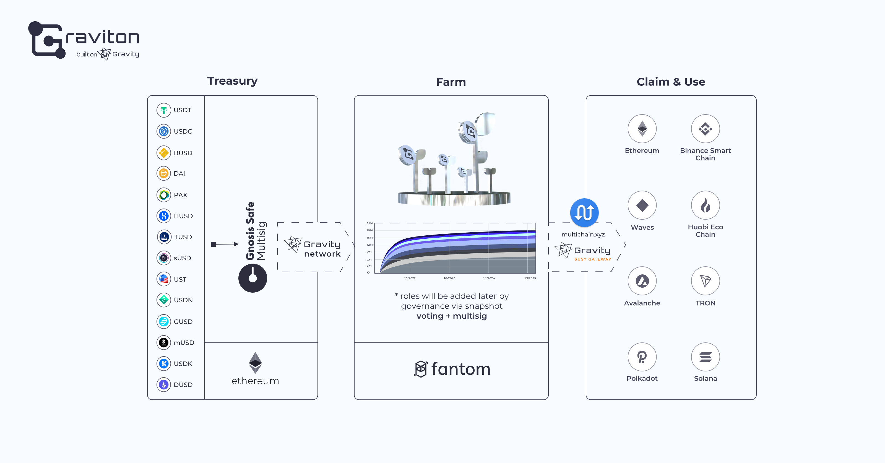

# Interchain Treasury Farming Architecture

Graviton governance is initiated through treasury farming, a novel DAO concept for self-financing, decentralized development and governance token issuance. This article describes the mechanics of farming in the treasury of the Graviton project. As a foundational element, Graviton uses a primary blockchain with many liquid stablecoins \(top 14 by market cap\) which are pegged against the US Dollar on the Ethereum blockchain. Treasury backers can deposit their stablecoins into the treasury by transferring to a multisig contract based on Gnosis Safe. Further, the event of the deposit is registered by the oracles of the [Gravity network](https://gravity.tech) and transmitted to a smart contract on the [Fantom blockchain](https://fantom.foundation/).

In the smart contracts on the Fantom network, a mapping of backers' addresses takes place their current share is registered in the Treasury. For each time interval, the share of new mined Graviton tokens \($GTON\) is distributed proportionally to the backers. The total supply is capped at 21 million tokens, and its emission is asymptotically decaying. Initially, the token is non-claimable, as this feature will only be activated later after the early bird period. The additional parameters of farming distribution will be decided through votings of consuls - delegates who have been vested with governance power by the holders of GTON. The original GTONs will become available on the Fantom blockchain itself, but by using the multi-chain \(fusion\) and Gravity bridges \(SuSy\), holders can swap those into other integrated blockchain networks such as BSC, Ethereum, Heco, Waves, Avalanche, Tron, Polka or Solana \(this list will be extended by integrating new chains into bridges\). Holders will be able to freely choose what bridges to use for swapping, depending on their use cases. 

The emission cycle of farming with two users as a simple example is presented below:

At any time backers can increase their treasury balance and therefore their current share, thereby diluting the share of future farming rewards paid out to other users. The smart contract takes into account any changes in the balances, and recalculates the distribution proportions of the minted tokens accordingly. It is worth noting that after the early bird period, the shares of early backers from farming are no longer diluted. Treasury deposits are not withdrawable in the strict sense, but if the holders of Graviton tokens decide to withdraw a part of the deposit as a result of voting, the withdrawal can be arranged. The Treasury is intended to serve as a long-term financing source of the project, developers, infrastructure or other purposes where financial costs are inevitable. Despite the fact that Treasury farming is initially a seed stage for boostrapping the project and distributing governance tokens among the most loyal and interested community members, its key function is to initiate a sustainable financial architecture of the project for the future. Subsequently, other mechanics of farming, governance and the logic of distributing rewards from farming and from commissions generated by the graviton system will be connected into an integral economic incentive system.

The main goal of Graviton remains the same: to create a mechanism that stimulates the development of cross-chain integrations at the level of digital assets, which can only be made possible with an increase in the liquidity of wrapped tokens in various blockchain networks. Cross-chain is not a buzzword. It is a major technical debt of the industry that needs to be addressed in order to open the space up for new trading, product and investment strategies that involve users across as many integrated ecosystems as possible.

Farm source code: [https://github.com/Graviton-One/graviton-treasury/tree/develop](https://github.com/Graviton-One/graviton-treasury/tree/develop)

